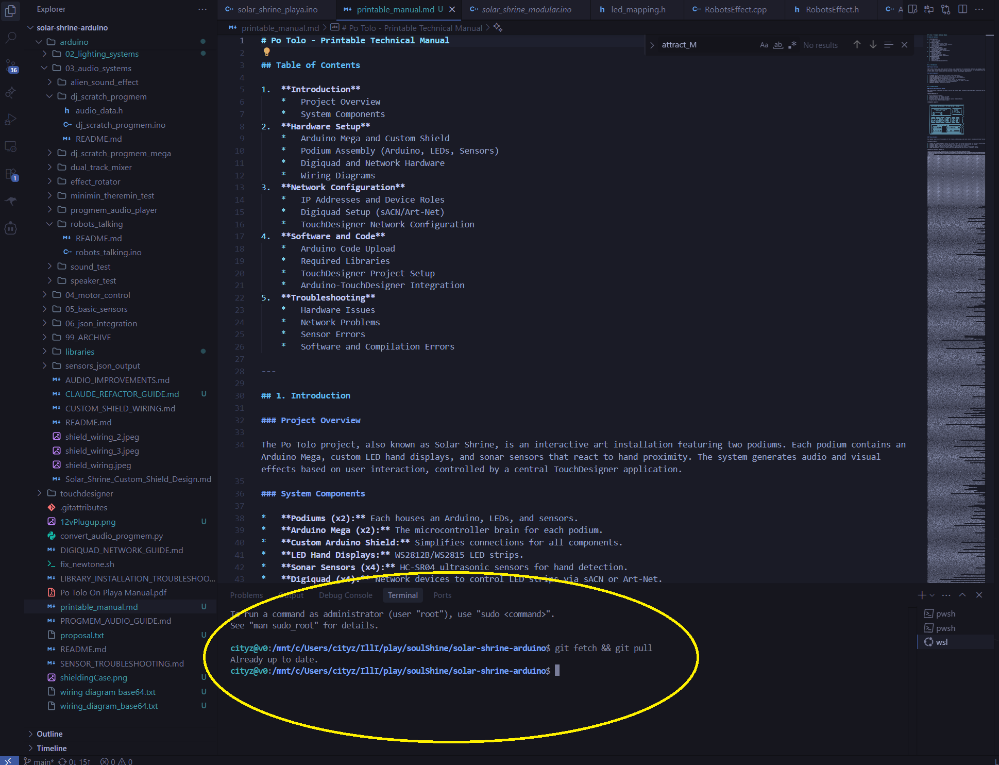
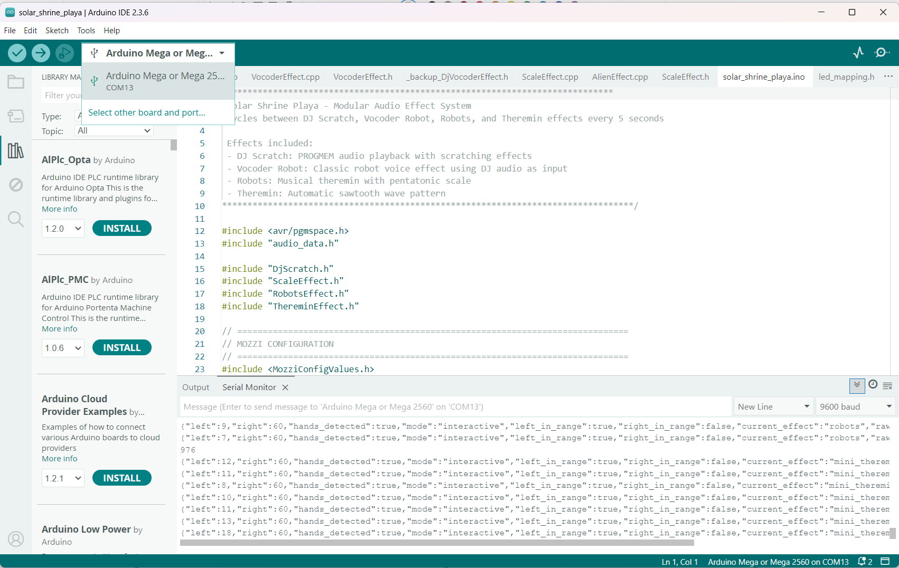

# Solar Shrine Playa System – Detailed README

This document explains how the `arduino/01_MAIN_SYSTEM/solar_shrine_playa` sketch works in depth and how it integrates into the larger Po Tolo (Solar Shrine) project. It also includes precise field instructions for the Burning Man technician to update and upload the code.

Contents
- Overview and Project Context
- Hardware and Timing
- Audio System and Modes
- LED System and Attract/Interactive Modes
- Sensors and Hand Detection
- Mode Rotation and Timeouts
- Data Protocol (if applicable)
- Files and Structure
- Technician Upload Instructions (Field Procedure)

## Overview and Project Context
- The Po Tolo project features two podiums with Arduino Megas driving LED “hand” displays and audio effects controlled by ultrasonic sensors. See `printable_manual.md` for the high-level system description.
- The playa sketch (`solar_shrine_playa.ino`) is the production runtime for the podium, coordinating:
  - Sensor reading and hand detection
  - Audio effect selection and synthesis/playback
  - LED visuals in both attract and interactive modes
  - Rotation and timeouts

## Hardware and Timing
- Board: Arduino Mega (per podium)
- Audio output:
  - DJ Scratch audio via Timer1 ISR on OCR1B (pin 12)
  - Mozzi audio is used by some modes (e.g., theremin or robots variants). The sketch starts/stops Mozzi per-mode to avoid conflicts.
- LEDs: WS2812B on `LED_PIN` with `NUM_LEDS`. Physical mapping is handled by `led_mapping.h`.
- Ultrasound sensors (HC-SR04): left and right, sampled and averaged to provide robust hand presence.

Key timing components in `solar_shrine_playa.ino`:
- Timer1 ISR for the DJ Scratch audio (`ISR(TIMER1_COMPB_vect)`), which either outputs scratch or silences DJ output during vocoder mode (vocoder taps the DJ stream as input).
- Mozzi’s `audioHook()` is called from `loop()` only when a Mozzi mode is active and initialized.

## Audio System and Modes
- Modes are enumerated by `AudioMode` (e.g., `MODE_DJ_SCRATCH`, `MODE_VOCODER_ROBOT`, `MODE_MOZZI_ROBOTS`, `MODE_MOZZI_THEREMIN`). The sketch rotates between modes only while idle/no-hands.
- DJ Scratch:
  - Audio runs in Timer1 ISR and plays PROGMEM samples with scratch manipulation.
  - In `MODE_VOCODER_ROBOT`, DJ ISR continues to feed audio to the vocoder input, but the direct DJ output is silenced (`OCR1B = 200`).
- Vocoder (DjVocoderEffect):
  - Independent from Mozzi; uses the DJ audio as modulator and internally generated carriers; 4-band split and simple filters.
  - Controls: Left hand starts playback and controls pitch; right hand shapes robot intensity.
- Mozzi-based modes (e.g., mini-theremin or robots variant):
  - Mozzi is started on entry, `audioHook()` is serviced in `loop()`, and Mozzi is stopped on exit or when returning to attract.
- Robots effect (non-Mozzi in playa version): see `RobotsEffect.cpp`.
  - Pitch (right hand) maps to a pentatonic scale with gentle vibrato and persistence.
  - Volume (left hand) applies a smoothed envelope.
  - Output is scaled by the smoothed volume (robotCurrentVol) in `audio()`.
- Alien effect (`AlienEffect.cpp`):
  - Uses oscillators with vibrato, motion-reactive harmonics and echo; in playa project, audio approach mirrors robots pattern.

## LED System and Attract/Interactive Modes
- The playa sketch now mirrors the modular sketch’s attract/interactive model:
  - `LightMode` enum with `ATTRACT_MODE` and `INTERACTIVE_MODE`.
  - `getInteractiveColor(distance)`: maps distance to red→yellow for each half of the strip.
  - `getAttractColor(time)`: sinusoidal fade between red and yellow across the whole strip.
  - `updateLEDs(...)`: when in ATTRACT shows the attract color globally; in INTERACTIVE shows split colors per left/right average distances; updates `lastLeftColor/lastRightColor` for smooth transition back to attract.
  - A small visual state machine requires three consecutive detections before leaving ATTRACT, and returns to ATTRACT after 10 seconds without hands.
- Per-effect LED visuals:
  - Some modes render their own visuals during interactive mode (DJ wave, Alien orb, Mini-Theremin fireball). The background `updateLEDs()` is skipped while those effects are actively drawing.

## Sensors and Hand Detection
- Distances are read from left/right HC-SR04s and inserted into rolling buffers (`SAMPLES=5`).
- `getAveragedDistance()` sums valid samples (5–50 cm, with slight allowance for very close ~4.5 cm) and requires at least 3 of 5 valid samples to avoid false positives.
- Hand presence flags:
  - `inRange1`/`inRange2` true if averaged distance is within 5–50 cm.
  - `handsDetected = inRange1 || inRange2`.
- Debounce in attract: while in ATTRACT, require 3 consecutive `handsDetected` frames to actually switch to INTERACTIVE.

## Mode Rotation and Timeouts
- When hands are absent:
  - After 5 seconds idle, the sketch rotates to the next mode (no audio played during rotation). Rotation cadence is tracked by `lastEffectRotationTime`.
  - After 10 seconds (INTERACTIVE_TIMEOUT) of no hands, the system returns to ATTRACT and resets rotation back to `MODE_DJ_SCRATCH` so that the next user always starts with DJ Scratch. Mozzi is stopped if it was active.
- When hands appear:
  - On rising edge, the current mode is initialized (`modeInitialized=false` triggers setup). Mozzi starts if the mode requires it.

## Data Protocol
- The playa sketch assembles status JSON (similar to modular) for external tools as needed; ensure baud and serial handling match TouchDesigner expectations (see TouchDesigner section in the main manual if applicable).

## Files and Structure
- `solar_shrine_playa.ino`: Main sketch. Contains loop, timers, state machines, attract/interactive LED helpers, and rotation logic.
- `led_mapping.h`: Utilities for spatial mapping of LEDs to the two “hands,” grid helpers, and traversal paths. The per-effect visuals use these helpers.
- `RobotsEffect.cpp/h`: Robot oscillator effect (pitch/volume, vibrato, pentatonic quantization, smoothed level accessor for LEDs).
- `AlienEffect.cpp`: Alien oscillator-based effect.
- Additional effects (DJ Scratch, vocoder) live in their respective modules and are coordinated by the main sketch.

## Technician Upload Instructions (Field Procedure)
Copy and paste the following block. Follow exactly.

"To update the code on the arduinos, you'll need to go to a place with internet with your laptop and do the token:
1. open cursor. It should automatically open to the directory. 
2. Run 'git fetch && git pull' in the terminal

3. Open arduino/solar_shrine_playa/solar_shrine_playa.ino in Arduino IDE
4. Hit upload botton (it should compile but fail the uplaod because you won't be connected to the arduino. 
5. Take your laptop to the podiums.
6. Disconnect the usb cord that connects to the arduino from the end connected to the adapter. Plug that up to your laptop.
7. Repeat step 4 after selecting the correct port from the dropdown next to the uplaod button (it'll say Arduino Mega...)

8. Reconnect the usb to the adapter
9. Repeat for other mac mini
Extra credit if you plug up a monitor to each mac mini and 
1. transfer the git hub repo files from the laptop to the mac mini to the solar_shrine_arduino folder on the desktop. Just got replace all.
2. Go into touchdesigner and make sure the arduino interface component's serial dat node has the port set correctly (it should read something like usbmodem...)"

Notes:
- On Arduino IDE, select the correct board (Arduino Mega) and the correct serial port from the dropdown next to the Upload button.
- If upload fails due to port busy, close any serial monitor or TouchDesigner connections, then retry.

## Operational Tips
- If LEDs stutter during Mozzi modes, ensure sensor timeouts are modest and that `audioHook()` is only called while in a Mozzi mode.
- If sound is too loud/quiet in Robots effect, check `RobotsEffect::audio()` scales by `robotCurrentVol` (left hand controls volume).
- If system stays in a non-DJ mode after idle, confirm the 10s timeout logic in `loop()` resets `currentMode = MODE_DJ_SCRATCH` and stops Mozzi, and re-enters ATTRACT mode.

## Versioning
- Use `git fetch && git pull` before field deployment.
- Commit messages in this repo will indicate changes to effects, LED behaviors, and deployment fixes.
