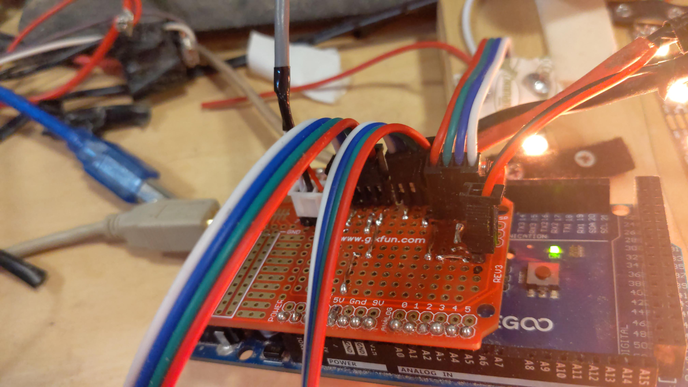
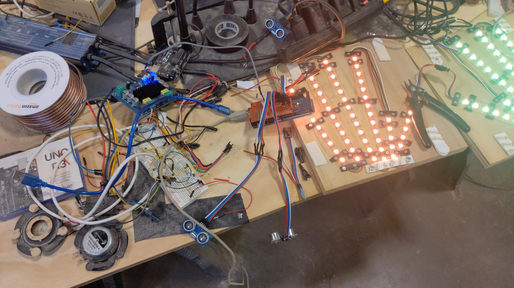
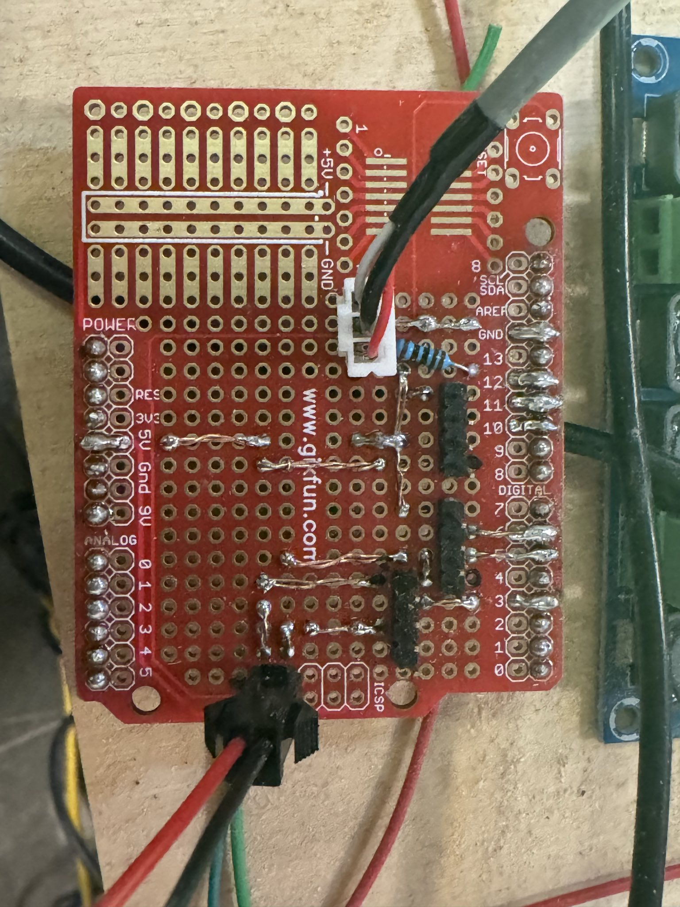

# Solar Shrine - Custom Shield Wiring Guide

This document details the wiring of the custom protoboard shield used with the Arduino Mega 2560 for the Solar Shrine project.

## Image Gallery

The following images show the project setup and the specific wiring of the custom shield. **Click on any image filename to view the full-resolution version.**

### Figure 1: Project Overview
*This image shows the complete test bench, including the Arduino Mega, the custom shield, ultrasonic sensors, audio exciters, and the hand-shaped LED strip.*



**Key components visible:**
- Arduino Mega 2560 with custom red protoshield
- Two HC-SR04 ultrasonic sensors with blue PCBs
- Hand-shaped LED matrix with warm white/orange LEDs
- Audio exciter speakers (round black components)
- Various connecting wires and power distribution

### Figure 2: Shield Top View
*This is a close-up of the shield mounted on the Arduino Mega, showing the primary connectors for the sensors and the LED strip.*



**Connector details:**
- **Top connectors:** JST-style 4-pin headers for ultrasonic sensors
- **Right side:** 3-pin JST connector for LED strip data/power
- **Bottom area:** 2-pin header for audio output
- **Red PCB:** Standard Uno-sized prototyping shield

### Figure 3: Shield Bottom View (Wiring Details)
*This image shows the underside of the protoshield, detailing the point-to-point solder connections for all components.*



**Wiring implementation:**
- **Enameled copper wire:** Used for all point-to-point connections
- **Power rails:** 5V and GND distribution across the board
- **Pin assignments:** Direct solder connections to Arduino Mega pins
- **1K resistor:** Visible for audio output current limiting

## Shield Wiring Analysis

Based on the images, the custom protoshield provides dedicated connections for the ultrasonic sensors, the LED strip, and the audio output. The wiring has been implemented to match the Solar Shrine Modular System's pinout on the Arduino Mega.

### Pin Connections and Hardware

*   **Left Ultrasonic Sensor (4-pin JST-style connector):**
    *   **VCC:** Connects to the 5V rail.
    *   **GND:** Connects to the GND rail.
    *   **Trig:** Wired to **Pin 10**.
    *   **Echo:** Wired to **Pin 11**.

*   **Right Ultrasonic Sensor (4-pin JST-style connector):**
    *   **VCC:** Connects to the 5V rail.
    *   **GND:** Connects to the GND rail.
    *   **Trig:** Wired to **Pin 5**.
    *   **Echo:** Wired to **Pin 6**.

*   **LED Strip (3-pin JST-style connector):**
    *   **VCC:** Connects to the 5V rail (for WS2812B LEDs).
    *   **GND:** Connects to the GND rail.
    *   **Data:** Wired to **Pin 3**.

*   **Audio Output:**
    *   A **1K Ohm resistor** is soldered between **Pin 12** and the audio output line. This is the current-limiting resistor for the amplifier.
    *   The connection appears to be a 2-pin header for the audio output and ground.
        *   **Signal:** From the 1K resistor connected to **Pin 12**.
        *   **Ground:** Connects to the GND rail.

### Power Distribution

*   The shield uses the Arduino's onboard `5V` and `GND` pins to create power and ground rails.
*   These rails are then used to supply power to both ultrasonic sensors and the LED strip, which is a clean and effective way to manage power for these components.

### Shield Construction Notes

*   The shield is built on a standard "Uno size" protoboard, making it compatible with both Uno and Mega form factors.
*   The use of JST-style connectors provides a secure and reliable way to connect and disconnect the external components.
*   The point-to-point soldering is done with enameled copper wire, which is a common technique for creating permanent, custom circuits.

This custom shield is a robust and well-designed piece of hardware that perfectly complements the modular software system.

## Technical Specifications

### Shield Compatibility
- **Target Platform:** Arduino Mega 2560
- **Form Factor:** Uno-sized prototyping shield
- **PCB Color:** Red (standard prototyping board)
- **Construction:** Point-to-point soldering with enameled copper wire

### Complete Wiring Diagram (Text Format)

```
Arduino Mega 2560 Pin Assignments:
┌─────────────────────────────────────────┐
│  Pin │ Function        │ Connection     │
├──────┼─────────────────┼────────────────┤
│  3   │ LED Data        │ WS2812B Strip  │
│  5   │ Right Sensor    │ HC-SR04 Trig   │
│  6   │ Right Sensor    │ HC-SR04 Echo   │
│  10  │ Left Sensor     │ HC-SR04 Trig   │
│  11  │ Left Sensor     │ HC-SR04 Echo   │
│  12  │ Audio Output    │ 1KΩ → Amplifier│
│  5V  │ Power Rail      │ All Components │
│  GND │ Ground Rail     │ All Components │
└─────────────────────────────────────────┘
```

### Connector Pinouts

#### Ultrasonic Sensor Connectors (4-pin JST)
```
Left Sensor (J1):          Right Sensor (J2):
Pin 1: VCC → 5V            Pin 1: VCC → 5V
Pin 2: Trig → Pin 10       Pin 2: Trig → Pin 5
Pin 3: Echo → Pin 11       Pin 3: Echo → Pin 6
Pin 4: GND → GND           Pin 4: GND → GND
```

#### LED Strip Connector (3-pin JST)
```
LED Connector (J3):
Pin 1: VCC → 5V
Pin 2: Data → Pin 3
Pin 3: GND → GND
```

#### Audio Output Connector (2-pin Header)
```
Audio Connector (J4):
Pin 1: Signal → Pin 12 (via 1KΩ resistor)
Pin 2: GND → GND
```

### Performance Notes
- **Power Distribution:** Centralized 5V/GND rails minimize voltage drop
- **Signal Integrity:** Short trace lengths reduce noise and interference
- **Modularity:** JST connectors allow easy component swapping
- **Reliability:** Point-to-point wiring provides robust connections 